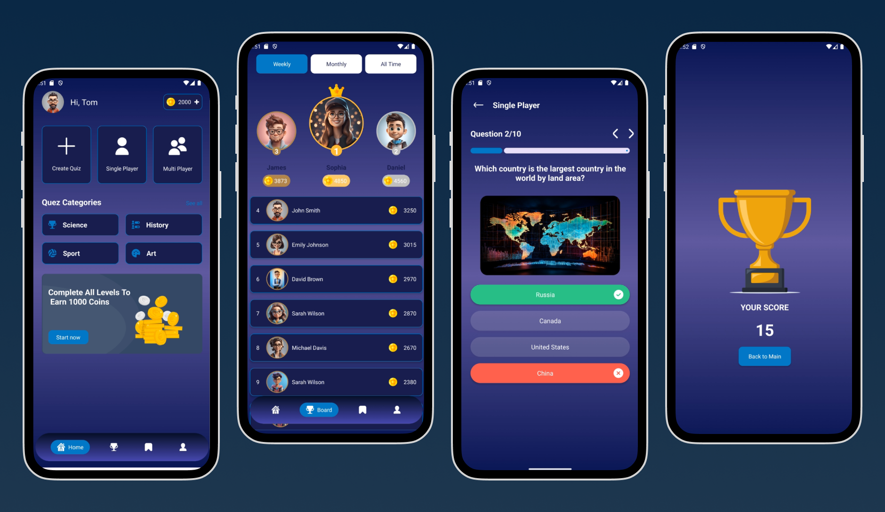

# 📚 QuizApp - MVVM y Clean Architecture

**QuizApp** es una aplicación de preguntas y respuestas desarrollada en **Kotlin**, utilizando **MVVM** y siguiendo los principios de **Clean Architecture** para garantizar un código modular, mantenible y escalable. Actualmente, los datos de las preguntas provienen de un **mock**, pero se podrían obtener de una API en el futuro.

<p align="center">
  
</p>

## 📌 Características

✅ Juego de preguntas con múltiples opciones.

✅ Sistema de puntuación automática al finalizar las preguntas.

✅ Listado de líderes basado en una lista estática de usuarios.

✅ **Mock** de preguntas y respuestas, con posibilidad de integrarse con una API.

## ⚙️ Tecnologías y Librerías

| Tecnologías / Librerías | Descripción |
| --- | --- |
| **Kotlin** | Lenguaje principal de desarrollo. |
| **MVVM (ViewModel, StateFlow)** | Arquitectura utilizada para separación de lógica. |
| **Hilt** | Inyección de dependencias. |
| **Coroutines / Flow** | Manejo de datos en segundo plano. |
| **Glide** | Carga de imágenes eficiente. |
| **RecyclerView** | Listado dinámico para preguntas y líderes. |
| **lifecycle-viewmodel-ktx** | Biblioteca de ViewModel para manejar el ciclo de vida de la UI |

---

## 📲 Instalación y Ejecución

### **1️⃣ Clonar el repositorio**

```
git clone https://github.com/tu-usuario/QuizApp.git
cd QuizApp
```

### **2️⃣ Abrir en Android Studio**

- Abre **Android Studio** y selecciona "Open an Existing Project".
- Elige la carpeta del proyecto y espera a que se configure.

### **3️⃣ Compilar y ejecutar**

- Conecta un **emulador** o un **dispositivo físico**.
- Haz clic en **Run ▶** para ejecutar la app.